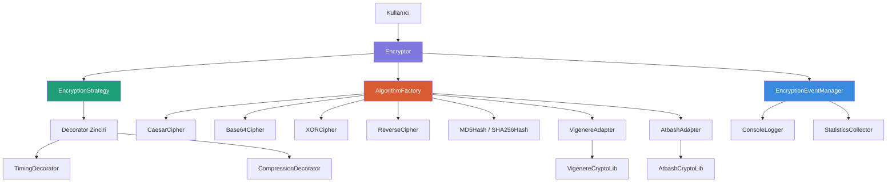

# Şifreleme Aracı (Encryption Tool)

**Konu: E — Şifreleme Aracı**

## Konu Seçim Gerekçesi
Şifreleme aracını seçtim çünkü farklı algoritmaların runtime'da seçilmesi ve birlikte çalışması gerekiyor. Bu yapı, nesne yaratma ve davranış yönetimi örüntülerini doğal bir şekilde uygulamaya olanak veriyor.

## Kullanılan Tasarım Örüntüleri

| Örüntü | Kategori | Açıklama |
|--------|----------|----------|
| **Factory Method** | Creational | Algoritma nesnelerini merkezi bir factory üzerinden üretir |
| **Adapter** | Structural | Harici kütüphaneleri ortak `EncryptionAlgorithm` arayüzüne uyarlar |
| **Decorator** | Structural | Loglama, zamanlama, sıkıştırma gibi ek davranışları zincirleme ekler |
| **Strategy** | Behavioral | Runtime'da algoritma değiştirmeyi sağlayan context yapısı |
| **Observer** | Behavioral | Şifreleme olaylarını bağımsız dinleyicilere bildirir |

## Mimari Diyagram



## Proje Yapısı

```
├── README.md                  ← Bu dosya
├── PATTERNS.md               ← Her örüntünün belgelenmesi
├── PROBLEMS.md               ← Başlangıç kodunun analizi (Faz 0)
├── src/
│   ├── encryptor.py          ← Ana uygulama
│   ├── factory.py            ← Factory Method
│   ├── strategy.py           ← Strategy Pattern
│   ├── observers.py          ← Observer Pattern
│   ├── decorators.py         ← Decorator Pattern
│   ├── adapters.py           ← Adapter Pattern
│   ├── external_libs.py      ← Harici kütüphane simülasyonu
│   └── algorithms/
│       ├── base.py           ← Abstract base class
│       ├── caesar.py         ← Caesar şifreleme
│       ├── base64_cipher.py  ← Base64 kodlama
│       ├── xor.py            ← XOR şifreleme
│       ├── reverse.py        ← Ters çevirme
│       └── hashing.py        ← MD5 ve SHA-256 hash
├── tests/
│   └── test_encryptor.py     ← Birim testleri
├── docs/
│   ├── diagrams/             ← UML diyagramları
│   └── ai-log/
│       ├── phase1.md         ← Faz 1 AI kullanım logu
│       ├── phase2.md         ← Faz 2 AI kullanım logu
│       └── phase3.md         ← Faz 3 AI kullanım logu
└── .github/workflows/ci.yml  ← GitHub Actions CI
```

## Çalıştırma

```bash
# Uygulamayı çalıştır
python src/encryptor.py

# Testleri çalıştır
python -m pytest tests/ -v
```

## Desteklenen Algoritmalar
- **Caesar** — Kaydırma şifreleme (özelleştirilebilir shift değeri)
- **Base64** — Base64 kodlama/çözme
- **XOR** — XOR tabanlı şifreleme (anahtar gerektirir)
- **Reverse** — Metin ters çevirme
- **MD5** — MD5 hash (tek yönlü)
- **SHA-256** — SHA-256 hash (tek yönlü)
- **Vigenere** — Vigenere şifreleme (Adapter ile entegre)
- **Atbash** — Atbash şifreleme (Adapter ile entegre)
- ## Faz Geçmişi

| Faz | Kapsam | Uygulanan Pattern |
|-----|--------|-------------------|
| **Faz 0** | Başlangıç kodunun analizi, sorun tespiti | — |
| **Faz 1** | Nesne yaratma sorumluluğunun merkezileştirilmesi | Factory Method |
| **Faz 2** | Harici kütüphane entegrasyonu ve ek davranışlar | Adapter + Decorator |
| **Faz 3** | Runtime algoritma değişimi, olay sistemi, CI | Strategy + Observer |

Detaylı UML diyagramları için: [`docs/`](docs/)
