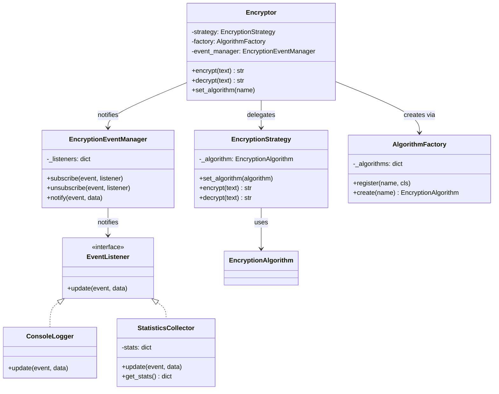

# Faz 3 — Strategy + Observer + CI (Final Mimari)

Runtime'da algoritma değişimi Strategy ile, olay bildirimi Observer ile sağlandı.

## Tüm Fazların Özeti

| Faz | Pattern | Çözülen Sorun |
|-----|---------|---------------|
| 0 | — | Sorun tespiti (PROBLEMS.md) |
| 1 | Factory Method | Nesne yaratma, if-else zincirleri |
| 2 | Adapter + Decorator | Harici entegrasyon, ek davranışlar |
| 3 | Strategy + Observer | Runtime değişimi, olay bildirimi |

## CI Pipeline

GitHub Actions ile her push'ta otomatik test çalıştırılıyor (`pytest`).
