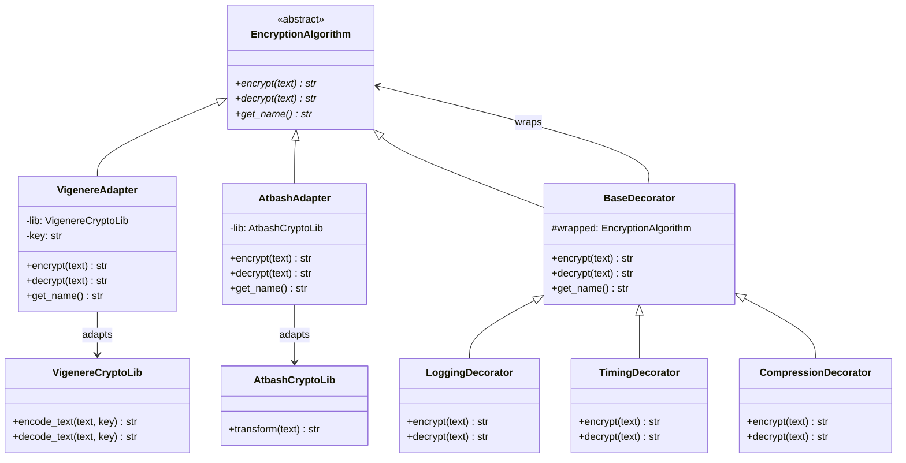

# Faz 2 — Adapter + Decorator Patterns

Harici kütüphaneler Adapter ile entegre, ek davranışlar Decorator ile eklendi.

## Tasarım Kararları

- **Neden Facade değil Adapter?** Sorun alt sistem karmaşıklığı değil, arayüz uyumsuzluğu. Harici kütüphaneler encrypt/decrypt yerine encode_text/decode_text veya transform kullanıyor.
- **Decorator sırası önemli:** CompressionDecorator en içte olmalı — önce sıkıştır, sonra şifrele. Tersi yapılırsa şifreli veri rastgele olduğu için sıkıştırma işe yaramaz.
