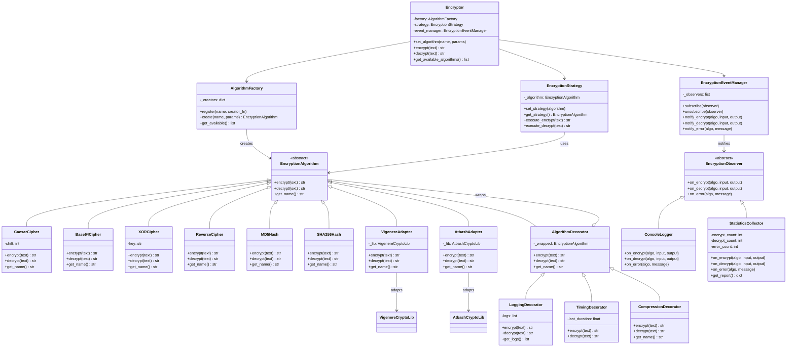

# UML Sınıf Diyagramı

## Genel Mimari

```mermaid
classDiagram
    class EncryptionAlgorithm {
        <<abstract>>
        +encrypt(text) str
        +decrypt(text) str
        +get_name() str
    }

    class CaesarCipher {
        -shift: int
        +encrypt(text) str
        +decrypt(text) str
        +get_name() str
    }

    class Base64Cipher {
        +encrypt(text) str
        +decrypt(text) str
        +get_name() str
    }

    class XORCipher {
        -key: str
        +encrypt(text) str
        +decrypt(text) str
        +get_name() str
    }

    class ReverseCipher {
        +encrypt(text) str
        +decrypt(text) str
        +get_name() str
    }

    class MD5Hash {
        +encrypt(text) str
        +decrypt(text) str
        +get_name() str
    }

    class SHA256Hash {
        +encrypt(text) str
        +decrypt(text) str
        +get_name() str
    }

    class VigenereAdapter {
        -_lib: VigenereCryptoLib
        +encrypt(text) str
        +decrypt(text) str
        +get_name() str
    }

    class AtbashAdapter {
        -_lib: AtbashCryptoLib
        +encrypt(text) str
        +decrypt(text) str
        +get_name() str
    }

    class AlgorithmDecorator {
        -_wrapped: EncryptionAlgorithm
        +encrypt(text) str
        +decrypt(text) str
        +get_name() str
    }

    class LoggingDecorator {
        -logs: list
        +encrypt(text) str
        +decrypt(text) str
        +get_logs() list
    }

    class TimingDecorator {
        -last_duration: float
        +encrypt(text) str
        +decrypt(text) str
    }

    class CompressionDecorator {
        +encrypt(text) str
        +decrypt(text) str
        +get_name() str
    }

    class AlgorithmFactory {
        -_creators: dict
        +register(name, creator_fn)
        +create(name, params) EncryptionAlgorithm
        +get_available() list
    }

    class EncryptionStrategy {
        -_algorithm: EncryptionAlgorithm
        +set_strategy(algorithm)
        +get_strategy() EncryptionAlgorithm
        +execute_encrypt(text) str
        +execute_decrypt(text) str
    }

    class EncryptionObserver {
        <<abstract>>
        +on_encrypt(algo, input, output)
        +on_decrypt(algo, input, output)
        +on_error(algo, message)
    }

    class EncryptionEventManager {
        -_observers: list
        +subscribe(observer)
        +unsubscribe(observer)
        +notify_encrypt(algo, input, output)
        +notify_decrypt(algo, input, output)
        +notify_error(algo, message)
    }

    class ConsoleLogger {
        +on_encrypt(algo, input, output)
        +on_decrypt(algo, input, output)
        +on_error(algo, message)
    }

    class StatisticsCollector {
        -encrypt_count: int
        -decrypt_count: int
        -error_count: int
        +on_encrypt(algo, input, output)
        +on_decrypt(algo, input, output)
        +on_error(algo, message)
        +get_report() dict
    }

    class Encryptor {
        -factory: AlgorithmFactory
        -strategy: EncryptionStrategy
        -event_manager: EncryptionEventManager
        +set_algorithm(name, params)
        +encrypt(text) str
        +decrypt(text) str
        +get_available_algorithms() list
    }

    EncryptionAlgorithm <|-- CaesarCipher
    EncryptionAlgorithm <|-- Base64Cipher
    EncryptionAlgorithm <|-- XORCipher
    EncryptionAlgorithm <|-- ReverseCipher
    EncryptionAlgorithm <|-- MD5Hash
    EncryptionAlgorithm <|-- SHA256Hash
    EncryptionAlgorithm <|-- VigenereAdapter
    EncryptionAlgorithm <|-- AtbashAdapter
    EncryptionAlgorithm <|-- AlgorithmDecorator

    AlgorithmDecorator <|-- LoggingDecorator
    AlgorithmDecorator <|-- TimingDecorator
    AlgorithmDecorator <|-- CompressionDecorator
    AlgorithmDecorator o-- EncryptionAlgorithm : wraps

    VigenereAdapter --> VigenereCryptoLib : adapts
    AtbashAdapter --> AtbashCryptoLib : adapts

    EncryptionObserver <|-- ConsoleLogger
    EncryptionObserver <|-- StatisticsCollector

    AlgorithmFactory --> EncryptionAlgorithm : creates
    EncryptionStrategy --> EncryptionAlgorithm : uses
    EncryptionEventManager --> EncryptionObserver : notifies

    Encryptor --> AlgorithmFactory
    Encryptor --> EncryptionStrategy
    Encryptor --> EncryptionEventManager
```
