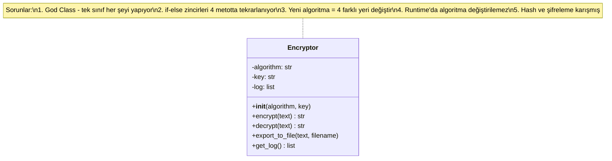

# Faz 0 — Başlangıç Durumu (Refactoring Öncesi)

Tek bir Encryptor sınıfı tüm sorumluluğu taşıyor.

## Sorun Özeti

- **7 farklı sorun** tespit edildi (bkz. PROBLEMS.md)
- En kritik sorun: nesne yaratma sorumluluğunun if-else zincirlerine dağılması
- Çözüm yolu: Design patterns ile sorumlulukları ayırmak
