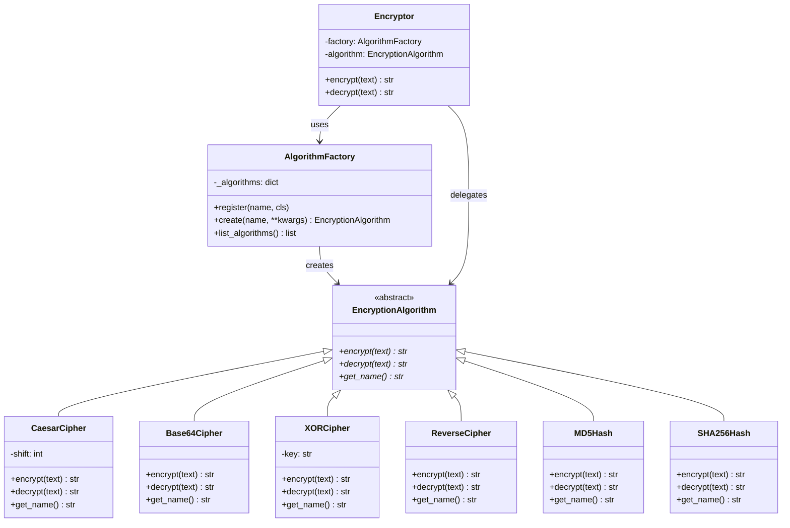

# Faz 1 — Factory Method Pattern

Nesne yaratma sorumluluğu AlgorithmFactory'ye taşındı.

## Çözülen Sorunlar

- ✅ if-else zincirleri kaldırıldı → Factory registry
- ✅ Nesne yaratma merkezi bir noktada → AlgorithmFactory
- ✅ Yeni algoritma = sadece yeni sınıf + register çağrısı
- ✅ Open/Closed Principle sağlandı
